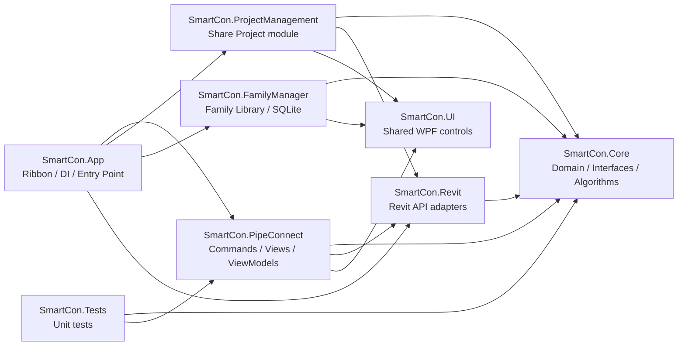

# SmartCon — Multi-Tool Plugin for Autodesk Revit

[](https://dotnet.microsoft.com/)
[](https://www.autodesk.com/products/revit/)
[](https://learn.microsoft.com/en-us/dotnet/csharp/)
[](LICENSE)
[]()
[](https://github.com/Alexandrisius/AGK-SmartCon-Pro/actions/workflows/build.yml)

**SmartCon** — набор инструментов для MEP-инженеров в Autodesk Revit.
Автоматизация соединений, управление семействами, экспорт проектов и другие рутинные операции — всё в одном плагине.

> [Полное руководство пользователя (USER-GUIDE.md)](USER-GUIDE.md) — пошаговые инструкции, все бизнес-кейсы, скриншоты UI.

---

## Команды

| Команда | Описание | Видео |
|---------|----------|-------|
| **PipeConnect** | Соединение MEP-элементов в 3D двумя кликами | [YouTube](https://www.youtube.com/watch?v=F55N9cCMIMk) |
| **Share Project** | Экспорт модели в Shared-зону (ISO 19650) | *скоро* |
| **FamilyManager** | Управление библиотекой семейств Revit (dockable panel, SQLite каталог) | *скоро* |

---

<div align="center">

### PipeConnect — Мечта всех MEP инженеров в Revit

[](https://www.youtube.com/watch?v=F55N9cCMIMk)

**Мечта всех MEP инженеров работающих в Revit. Бесплатный плагин SmartCon.**

</div>

---

## PipeConnect

Флагманский модуль SmartCon. Соединяет MEP-трубопроводы в 3D двумя кликами — с автоматическим подбором фитингов, переходников и типов соединений.

### Что делает

| Проблема в Revit | Решение SmartCon |
|---|---|
| Соединение в 3D — только перетаскиванием коннекторов | **2 клика** — элемент автоматически выравнивается |
| Нет системы типов соединений (сварка / резьба / раструб) | **ConnectionTypeCode** — типы назначаются и хранятся в семействах |
| Нет подбора фитингов по совместимости | **Автоматический поиск** фитинга по маппингу типов + размеров |
| Разные диаметры — ручной поиск переходника | **Автовставка reducer** с подбором типоразмера |
| Цепочки элементов — по одному | **Chain mode** — вся сеть перемещается как жёсткое тело |

### PipeConnect за 30 секунд

```
1. Откройте 3D-вид в Revit
2. Нажмите кнопку PipeConnect на ленте SmartCon
3. Кликните по ПЕРВОМУ элементу (тот, который будет перемещён)
4. Кликните по ВТОРОМУ элементу (неподвижный ориентир)
5. Откроется окно настройки — поверните, выберите фитинг
6. Нажмите «Соединить» — готово!
```

> **Одно действие = одна запись Undo.** Если что-то не так — Ctrl+Z откатит всё.

### Ключевые сценарии

**1. Простое соединение — одинаковые диаметры и типы**
Труба DN50 (сварка) → Кран DN50 (сварка) → **прямое соединение без фитинга**.

**2. Автоподбор размера**
Труба DN65 → Кран DN50 → SmartCon **автоматически переключит кран на DN65** (если типоразмер существует).

**3. Автовставка переходника (Reducer)**
Труба DN50 → Кран DN40 (нет типоразмера DN50) → SmartCon **вставит переходник DN50/DN40**.

**4. Фитинг-переходник для разных типов соединений**
Труба DN50 (сварка) → Кран DN50 (резьба) → SmartCon **подберёт и вставит фитинг** по вашим правилам маппинга.

**5. Цепочка элементов**
Кран + труба + тройник + отвод → **вся сеть перемещается** и соединяется одним действием.

**6. Ручная корректировка в финальном окне**
Поворот на любой угол, смена коннектора, выбор фитинга из списка, смена размера — всё до нажатия «Соединить».

> Подробно — в [USER-GUIDE.md](USER-GUIDE.md).

---

## Share Project

Модуль для экспорта Revit-модели в Shared-зону по стандарту **ISO 19650**.
Автоматизирует полный цикл: Sync → Detach → Purge → SaveAs с валидацией имени файла.

### Share Project за 30 секунд

```
1. Нажмите Settings (Project Management) — настройте шаблон имени и Field Library
2. Укажите Shared-папку для экспорта
3. Нажмите Share Project — плагин проверит имя файла
4. Если имя невалидно — диалог предложит исправить поля вручную
5. Модель синхронизируется, очищается и сохраняется в Shared-зону — готово!
```

### Ключевые возможности

- **Шаблон имени файла** — настраиваемый парсинг текущего имени на блоки (проект, дисциплина, уровень и т.д.)
- **Field Library** — библиотека полей с валидацией: разрешённые значения, мин/макс длина
- **Export Mappings** — подмена значений полей при экспорте (например, `AR → Architecture`)
- **Purge модели** — 12 категорий очистки: RVT-линки, CAD-импорты, изображения, облака точек, группы, сборки, пространства, арматура, листы, спецификации, неиспользуемые элементы
- **Выбор видов для сохранения** — фильтрация по имени, группировка по типу
- **Автоматическая валидация имени файла** — если имя не проходит проверку, диалог предлагает заполнить поля вручную
- **Полный цикл для workshared-моделей** — Sync → Detach from Central → Purge → SaveAs → повторное открытие локального файла
- **Прогресс-бар** — отображение каждого этапа экспорта в реальном времени
- **Импорт/Экспорт настроек** — перенос конфигурации между проектами через JSON

---

## FamilyManager

Dockable panel для управления библиотекой семейств Revit — BIM content management внутри SmartCon.
Импорт, каталогизация, поиск, версионность и загрузка семейств в проект — всё из одного окна.

### FamilyManager за 30 секунд

```
1. Нажмите FamilyManager на панели Family Library
2. При первом запуске — создайте базу данных (укажите папку)
3. Перетащите .rfa-файл на панель или нажмите Import
4. Семейство появится в каталоге с автоматическим извлечением метаданных
5. Выберите семейство → Load для загрузки в текущий проект
6. Или Load & Place — загрузить и сразу разместить экземпляр
```

### Ключевые возможности

| Возможность | Описание |
|---|---|
| **Dockable panel** | Каталог семейств всегда под рукой — не закрывает модель |
| **SQLite-каталог** | Быстрый поиск, фильтрация, дерево категорий |
| **Импорт** | Drag-and-drop .rfa или через диалог (одиночный / папка) |
| **Published Storage** | Статусы Active/Deprecated/Retired — управление жизненным циклом (ADR-015) |
| **Версии** | Поддержка нескольких версий Revit для одного семейства |
| **Assets** | Вспомогательные файлы (изображения, документы) привязаны к семейству |
| **Load & Place** | Загрузка семейства в проект и размещение экземпляра |
| **Multi-database** | Подключение к нескольким каталогам (личный, корпоративный) |

> Подробно — в [USER-GUIDE.md](USER-GUIDE.md#часть-3-familymanager).

---

## Ribbon — интерфейс в Revit

После установки на ленте Revit появляется вкладка **SmartCon** с тремя панелями:

### Pipe Systems

| Кнопка | Назначение |
|--------|-----------|
| **PipeConnect** | Соединение MEP-элементов двумя кликами |
| **Settings** | Настройка типов коннекторов и правил маппинга фитингов |

### Project Management

| Кнопка | Назначение |
|--------|-----------|
| **Share Project** | Экспорт модели в Shared-зону |
| **Settings** | Настройка шаблона имени, Field Library, purge-опций, видов |

### Family Library

| Кнопка | Назначение |
|--------|-----------|
| **FamilyManager** | Открыть/закрыть панель управления семействами |

### Info

| Кнопка | Назначение |
|--------|-----------|
| **About** | Информация о версии, проверка обновлений, смена языка |

---

## Установка

1. Скачайте последнюю версию со страницы [Releases](https://github.com/Alexandrisius/AGK-SmartCon-Pro/releases)
2. Запустите `SmartCon-Setup.exe` — установщик определит версии Revit автоматически
3. Перезапустите Revit — на ленте появится вкладка **SmartCon**

Установщик не требует прав администратора.

---

## Поддерживаемые версии

| Revit | Платформа | Папка установки |
|-------|-----------|-----------------|
| 2019–2020 | .NET Framework 4.8 | `%APPDATA%\SmartCon\2019-2020\` |
| 2021–2023 | .NET Framework 4.8 | `%APPDATA%\SmartCon\2021-2023\` |
| 2024 | .NET Framework 4.8 | `%APPDATA%\SmartCon\2024\` |
| 2025–2026 | .NET 8.0 | `%APPDATA%\SmartCon\2025\` |

Один бинарник R25 работает и в Revit 2025, и в Revit 2026.

---

## Язык интерфейса

SmartCon поддерживает **русский** и **английский** языки. Язык можно переключить в окне **About**. Настройка сохраняется между сессиями.

---

## Для разработчиков

<details>
<summary>Архитектура и стек</summary>



```
SmartCon.Core              — Чистый C#: модели, интерфейсы, алгоритмы (тестируется без Revit)
SmartCon.Revit             — Реализации интерфейсов Core через Revit API
SmartCon.UI                — Общие WPF-стили и контролы
SmartCon.App               — Точка входа: IExternalApplication, Ribbon, DI-контейнер
SmartCon.PipeConnect       — Модуль PipeConnect: Commands, ViewModels, Views
SmartCon.ProjectManagement — Модуль Share Project: Commands, ViewModels, Views, Settings
SmartCon.FamilyManager     — Модуль FamilyManager: управление библиотекой семейств (dockable panel, SQLite catalog)
SmartCon.Tests             — Unit-тесты (xUnit + Moq, 730 тестов)
```

| Компонент | Технология |
|-----------|-----------|
| Runtime | .NET 8.0 / .NET Framework 4.8 (multi-version) |
| Язык | C# 12 |
| UI | WPF + MVVM (CommunityToolkit.Mvvm) |
| Тесты | xUnit + Moq |
| Revit API | Revit 2019–2026 |

Ключевые архитектурные решения:
- **Clean Architecture** — Core определяет интерфейсы, Revit их реализует
- **TransactionGroup + Assimilate** — одна операция = одна запись Undo
- **Formula Engine** — AST-парсер формул Revit с SolveFor
- **IExternalEventHandler** — Revit API из WPF только через event handler (инвариант I-01)

См. [`docs/`](docs/) — полная документация для разработчиков.

</details>

<details>
<summary>Сборка из исходников</summary>

```bash
git clone https://github.com/Alexandrisius/AGK-SmartCon-Pro.git
cd AGK-SmartCon-Pro
dotnet build src/SmartCon.App/SmartCon.App.csproj -c Debug.R25
dotnet test src/SmartCon.Tests/SmartCon.Tests.csproj -c Debug.R25
build-and-deploy.bat
```

Multi-version shipping-артефакты:

| Конфигурация | Revit | TFM |
|---|---|---|
| `R19` | 2019–2020 | net48 |
| `R21` | 2021–2023 | net48 |
| `R24` | 2024 | net48 |
| `R25` | 2025–2026 | net8.0-windows |

**Требования:** .NET 8.0 SDK, Visual Studio 2022 или Rider.

</details>

<details>
<summary>Контрибьюция</summary>

1. Прочитайте [`docs/invariants.md`](docs/invariants.md) — жёсткие правила проекта
2. Прочитайте [`docs/architecture/dependency-rule.md`](docs/architecture/dependency-rule.md)
3. Ключевые правила:
   - Revit API из WPF — только через `IExternalEventHandler`
   - Транзакции — только через `ITransactionService`
   - `SmartCon.Core` не вызывает Revit API
   - Строгий MVVM — code-behind содержит только `DataContext = viewModel`

</details>

---

## Community & OSS

| Ресурс | Назначение |
|---|---|
| [CONTRIBUTING.md](CONTRIBUTING.md) | Правила сборки, тестов и оформления вкладов |
| [SECURITY.md](SECURITY.md) | Политика сообщений об уязвимостях |
| [CODE_OF_CONDUCT.md](CODE_OF_CONDUCT.md) | Правила поведения в сообществе |
| [CHANGELOG.md](CHANGELOG.md) | История изменений по SemVer |
| [Issue Templates](.github/ISSUE_TEMPLATE/) | Шаблоны bug report / feature request |

Автоматизация проекта разделена по ролям:

- `build.yml` — CI-проверка для `push` и `pull_request` (5 конфигураций)
- `build-and-deploy.bat` — локальная debug-сборка и деплой в установленный Revit
- `tools/release.ps1` — основной maintainer-скрипт релиза: version bump, build, tests, publish, ZIP, optional installer, tag, GitHub release

---

## Лицензия

MIT License — см. [LICENSE](LICENSE).

## Автор

**AGK** — инструменты автоматизации MEP для Autodesk Revit
