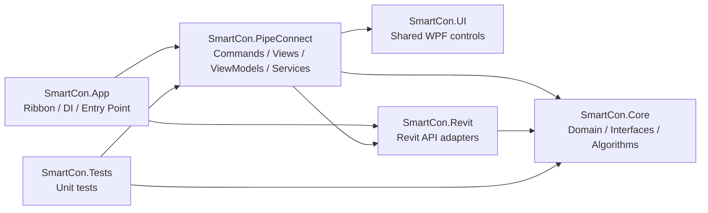

# SmartCon — Intelligent MEP Connector for Autodesk Revit

[](https://dotnet.microsoft.com/)
[](https://www.autodesk.com/products/revit/)
[](https://learn.microsoft.com/en-us/dotnet/csharp/)
[](LICENSE)
[]()
[](https://github.com/Alexandrisius/AGK-SmartCon-Pro/actions/workflows/build.yml)

**SmartCon** — плагин для Autodesk Revit, автоматизирующий рутинные операции соединения MEP-трубопроводов. Флагманский модуль **PipeConnect** позволяет соединять элементы двумя кликами с автоматическим подбором фитингов, переходников и типов соединений.

> 📖 **[Полное руководство пользователя (USER-GUIDE.md)](USER-GUIDE.md)** — пошаговые инструкции, все бизнес-кейсы, скриншоты UI.

---

<div align="center">

### 🎬 Видеообзор SmartCon

[](https://www.youtube.com/watch?v=F55N9cCMIMk)

**Мечта всех MEP инженеров работающих в Revit. Бесплатный плагин SmartCon.**

</div>

---

## Что делает SmartCon

| Проблема в Revit | Решение SmartCon |
|---|---|
| Соединение в 3D — только перетаскиванием коннекторов | **2 клика** — элемент автоматически выравнивается |
| Нет системы типов соединений (сварка / резьба / раструб) | **ConnectionTypeCode** — типы назначаются и хранятся в семействах |
| Нет подбора фитингов по совместимости | **Автоматический поиск** фитинга по маппингу типов + размеров |
| Разные диаметры — ручной поиск переходника | **Автовставка reducer** с подбором типоразмера |
| Цепочки элементов — по одному | **Chain mode** — вся сеть перемещается как жёсткое тело |

---

## Быстрый старт

### Установка

1. Скачайте последнюю версию со страницы [Releases](https://github.com/Alexandrisius/AGK-SmartCon-Pro/releases)
2. Запустите `SmartCon-Setup.exe` — установщик определит версии Revit автоматически
3. Перезапустите Revit — на ленте появится вкладка **SmartCon**

<details>
<summary>📦 Поддерживаемые версии Revit</summary>

| Revit | Платформа | Папка установки |
|-------|-----------|-----------------|
| 2019–2020 | .NET Framework 4.8 | `%APPDATA%\SmartCon\2019-2020\` |
| 2021–2023 | .NET Framework 4.8 | `%APPDATA%\SmartCon\2021-2023\` |
| 2024 | .NET Framework 4.8 | `%APPDATA%\SmartCon\2024\` |
| 2025 | .NET 8.0 | `%APPDATA%\SmartCon\2025\` |

Установщик не требует прав администратора.
</details>

<details>
<summary>🔧 Установка из исходников (для разработчиков)</summary>

```bash
git clone https://github.com/Alexandrisius/AGK-SmartCon-Pro.git
cd AGK-SmartCon-Pro
dotnet build src/SmartCon.App/SmartCon.App.csproj -c Debug.R25
dotnet test src/SmartCon.Tests/SmartCon.Tests.csproj -c Debug.R25
build-and-deploy.bat
```

Для multi-version используются 4 shipping-артефакта:

- `R19` → Revit 2019-2020
- `R21` → Revit 2021-2023
- `R24` → Revit 2024
- `R25` → Revit 2025

**Требования:** .NET 8.0 SDK, Visual Studio 2022 или Rider.
</details>

---

## Ribbon — интерфейс в Revit

После установки на ленте Revit появляется вкладка **SmartCon** с тремя кнопками:

| Кнопка | Назначение |
|--------|-----------|
| **PipeConnect** | Соединение MEP-элементов двумя кликами |
| **Settings** | Настройка типов коннекторов и правил маппинга фитингов |
| **About** | Информация о версии, проверка обновлений |

---

## PipeConnect за 30 секунд

```
1. Откройте 3D-вид в Revit
2. Нажмите кнопку PipeConnect на ленте SmartCon
3. Кликните по ПЕРВОМУ элементу (тот, который будет перемещён)
4. Кликните по ВТОРОМУ элементу (неподвижный ориентир)
5. Откроется окно настройки — поверните, выберите фитинг
6. Нажмите «Соединить» — готово!
```

> **Одно действие = одна запись Undo.** Если что-то не так — Ctrl+Z откатит всё.

---

## Ключевые сценарии (подробнее в [USER-GUIDE.md](USER-GUIDE.md))

### 1. Простое соединение — одинаковые диаметры и типы
Труба DN50 (сварка) → Кран DN50 (сварка) → **прямое соединение без фитинга**.

### 2. Автоподбор размера
Труба DN65 → Кран DN50 → SmartCon **автоматически переключит кран на DN65** (если типоразмер существует).

### 3. Автовставка переходника (Reducer)
Труба DN50 → Кран DN40 (нет типоразмера DN50) → SmartCon **вставит переходник DN50/DN40**.

### 4. Фитинг-переходник для разных типов соединений
Труба DN50 (сварка) → Кран DN50 (резьба) → SmartCon **подберёт и вставит фитинг** по вашим правилам маппинга.

### 5. Цепочка элементов
Кран + труба + тройник + отвод → **вся сеть перемещается** и соединяется одним действием.

### 6. Ручная корректировка в финальном окне
Поворот на любой угол, смена коннектора, выбор фитинга из списка, смена размера — всё до нажатия «Соединить».

---

## Первый запуск — настройка

Перед первым использованием PipeConnect нужно настроить **типы коннекторов** и **правила маппинга**:

1. Нажмите **Settings** на ленте SmartCon
2. Вкладка **«Типы коннекторов»** — добавьте типы (например: 1 = Сварка, 2 = Резьба, 3 = Раструб)
3. Вкладка **«Правила маппинга»** — задайте, какие фитинги использовать для каждой пары типов
4. Нажмите **Сохранить** — настройки сохраняются в текущем проекте Revit (`.rvt`) через **ExtensibleStorage** (ADR-012). Для переноса между проектами используйте кнопки **Импорт** / **Экспорт** (JSON).

> Подробная инструкция по настройке — в [USER-GUIDE.md → Первый запуск](USER-GUIDE.md#первый-запуск-настройка).

---

## Язык интерфейса

SmartCon поддерживает **русский** и **английский** языки. Язык можно переключить в окне **About**. Настройка сохраняется между сессиями.

---

## Для разработчиков

<details>
<summary>📐 Архитектура и стек</summary>



```
SmartCon.Core          — Чистый C#: модели, интерфейсы, алгоритмы (тестируется без Revit)
SmartCon.Revit         — Реализации интерфейсов Core через Revit API
SmartCon.UI            — Общие WPF-стили и контролы
SmartCon.App           — Точка входа: IExternalApplication, Ribbon, DI-контейнер
SmartCon.PipeConnect   — Модуль PipeConnect: Commands, ViewModels, Views
SmartCon.Tests         — Unit-тесты (xUnit + Moq, 676 тестов)
```

| Компонент | Технология |
|-----------|-----------|
| Runtime | .NET 8.0 / .NET Framework 4.8 (multi-version) |
| Язык | C# 12 |
| UI | WPF + MVVM (CommunityToolkit.Mvvm) |
| Тесты | xUnit + Moq |
| Revit API | Revit 2019–2025 |

Ключевые архитектурные решения:
- **Clean Architecture** — Core определяет интерфейсы, Revit их реализует
- **TransactionGroup + Assimilate** — одна операция = одна запись Undo
- **Formula Engine** — AST-парсер формул Revit с SolveFor

См. [`docs/`](docs/) — полная документация для разработчиков.

</details>

<details>
<summary>🤝 Контрибьюция</summary>

1. Прочитайте [`docs/invariants.md`](docs/invariants.md) — жёсткие правила проекта
2. Прочитайте [`docs/architecture/dependency-rule.md`](docs/architecture/dependency-rule.md)
3. Ключевые правила:
   - Revit API из WPF — только через `IExternalEventHandler`
   - Транзакции — только через `ITransactionService`
   - `SmartCon.Core` не вызывает Revit API
   - Строгий MVVM — code-behind содержит только `DataContext = viewModel`

</details>

## Community & OSS

| Ресурс | Назначение |
|---|---|
| [CONTRIBUTING.md](CONTRIBUTING.md) | Правила сборки, тестов и оформления вкладов |
| [SECURITY.md](SECURITY.md) | Политика сообщений об уязвимостях |
| [CODE_OF_CONDUCT.md](CODE_OF_CONDUCT.md) | Правила поведения в сообществе |
| [CHANGELOG.md](CHANGELOG.md) | История изменений по SemVer |
| [Issue Templates](.github/ISSUE_TEMPLATE/) | Шаблоны bug report / feature request |

Автоматизация проекта разделена по ролям:

- `build.yml` — CI-проверка для `push` и `pull_request`
- `release.yml` — GitHub-side релиз по тегу `v*`
- `build-and-deploy.bat` — локальная debug-сборка и деплой в установленный Revit
- `tools/release.ps1` — основной maintainer-скрипт релиза: version bump, build, tests, publish, ZIP, optional installer, tag, GitHub release

## Visuals

Скриншоты интерфейса и анимированные сценарии использования подробно вынесены в [USER-GUIDE.md](USER-GUIDE.md), чтобы основной `README` оставался компактным. При необходимости их можно продублировать в GitHub Releases и wiki.

---

## Лицензия

MIT License — см. [LICENSE](LICENSE).

## Автор

**AGK** — инструменты автоматизации MEP для Autodesk Revit
